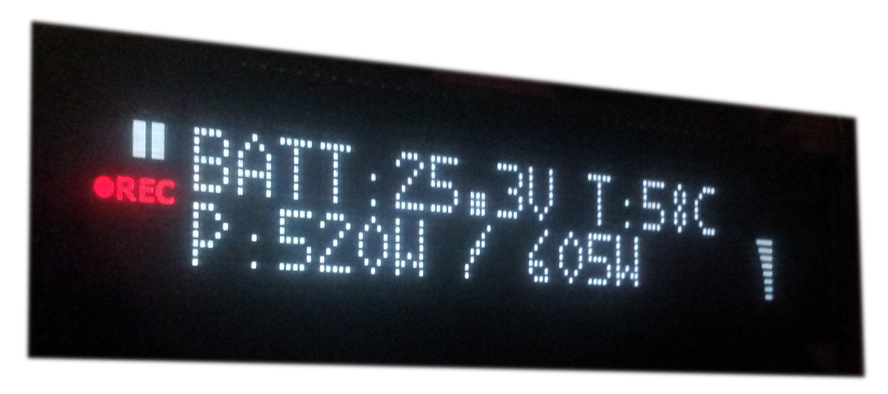
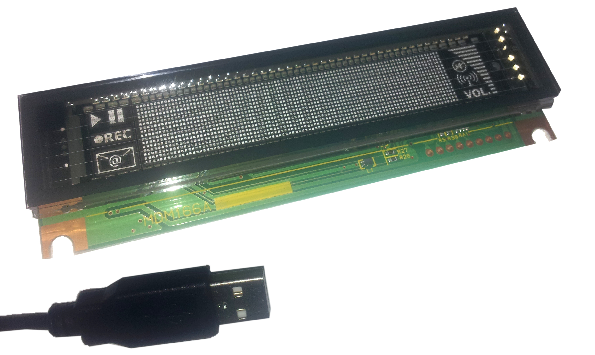

# VFD_MDM166
demo library for VFD MDM166 vid=0x19c2 pid=0x6a11

# Description:
This is a quick-and-dirty library to talk to the VFD MDM166A via USB.

# Tested configuration:
 - Linux Host System: Debian Stretch / Raspberry Pi 2 (Rasbian Jessie)
 - Python3.5 / Python 3.4
 
# Quick start:
Make sure, you installed all dependencies:
 - $ sudo apt-get install python3-dev libusb-1.0-0-dev libudev-dev python3-pip
 - $ sudo pip3 install --upgrade setuptools
 - $ sudo pip3 install hidapi
 
Connect the display via USB to the computer. It has two connectors - just take the USB-power-supply for both connectors. For details, see page 11 of the datasheet.

Talking to the display is very easy. Just send a few bytes (the right command), the length ahead and you're done. 

Example: Luminance adjustment
0x03 0x1B 0x40 0x02

For details take a look at the datasheet.

For your convenience there is the file VFD_MDM166.py so you don't have to remember the right  hex-commands. For the example above, just use 

myVFD.dimming(100) 

instead, as shown in 

write_display_example.py
